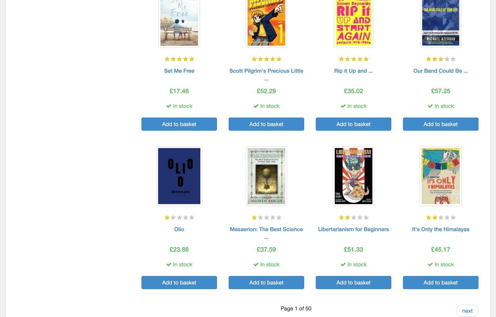
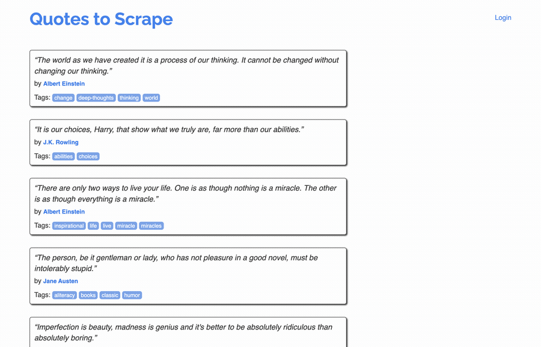
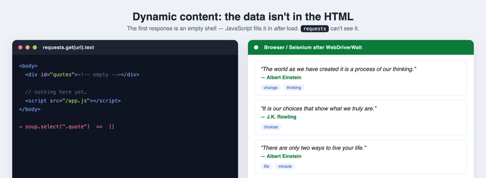
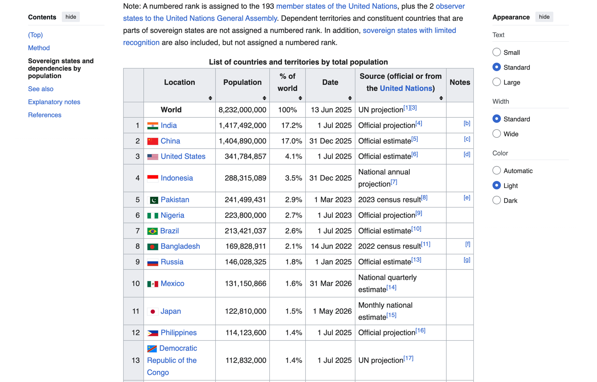
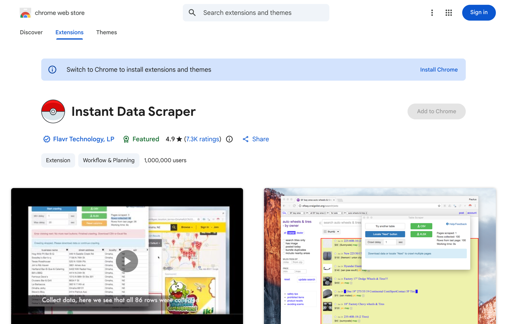
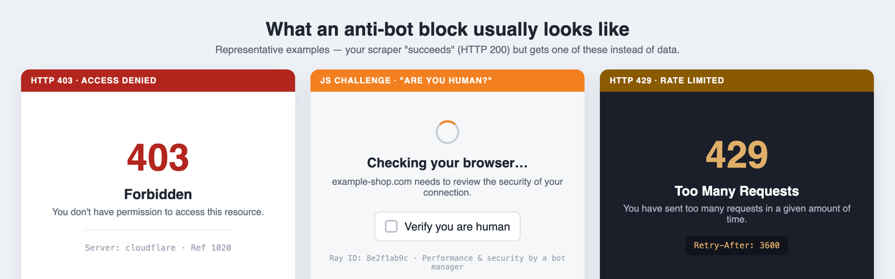

<div class="eyebrow">Hands-on Data Extraction</div>

# Web Scraping &amp; API Integration

#### Pulling Data from E-Commerce Sites

<div class="mt-10 opacity-80">
  From a single <code>requests.get()</code> to a concurrent, ethical crawler — BeautifulSoup, XPath, Selenium &amp; Scrapy, plus the security lab that explains why bot defenses exist.
</div>

<div class="abs-br m-6 text-sm opacity-60">
  <a href="https://github.com/thosangs/dibimbing_scraping">github.com/thosangs/dibimbing_scraping</a>
</div>

---
layout: section
---

<div class="eyebrow">Today's Journey</div>

# What we will build

<div class="grid grid-cols-2 gap-x-10 gap-y-3 mt-8 text-lg">
  <div>1 — Scraping vs APIs, and the ETL mindset</div>
  <div>2 — <code>uv</code>: zero-pain environments &amp; drivers</div>
  <div>3 — <code>requests</code> + BeautifulSoup fundamentals</div>
  <div>4 — BeautifulSoup vs XPath, easy → hard</div>
  <div>5 — Dynamic pages with Selenium &amp; explicit waits</div>
  <div>6 — Four hard cases, one slide each</div>
  <div>7 — Specialized + no-code extraction tools</div>
  <div>8 — Security lab: bot defenses &amp; how to respect them</div>
</div>

---

## Two ways to get the data

<div class="grid grid-cols-2 gap-8 mt-4">

<div class="card">

#### Call the API

```python
import requests
r = requests.get(
    "https://api.site.com/products",
    params={"page": 1},
)
data = r.json()
```

- Clean, structured **JSON**
- Stable &amp; fast — *always prefer this*
- Look in DevTools → **Network → XHR**

</div>

<div class="card">

#### Scrape the HTML

```python
from bs4 import BeautifulSoup
soup = BeautifulSoup(html, "lxml")
name = soup.select_one(".product .title").text
```

- Works when there is **no public API**
- Fragile: breaks when markup changes
- Heavier &amp; slower to parse

</div>

</div>

<div class="mt-6 muted">Rule of thumb: <span class="gold">find the API first</span>; scrape the DOM only when you must.</div>

---

## The pipeline: Extract → Transform → Load

<div class="grid grid-cols-3 gap-6 mt-6">

<div class="card">

#### Extract

```python
r = requests.get(url)
r.encoding = "utf-8"
soup = BeautifulSoup(r.text, "lxml")
```

Pull raw HTML / JSON from the source.

</div>

<div class="card">

#### Transform

```python
from price_parser import Price
price = Price.fromstring("£16.99").amount
rating = stars_to_int(node["class"])
```

Clean, type-cast, normalize.

</div>

<div class="card">

#### Load

```python
df.to_sql("products", conn,
          if_exists="replace")
```

Persist to SQLite / Postgres / CSV.

</div>

</div>

<div class="mt-8">Each repo <code>step</code> is one stage — run them in order, or run <code>pipeline.py</code> end-to-end.</div>

---

## Environments &amp; drivers with `uv`

<div class="grid grid-cols-2 gap-10 mt-4">

<div>

```bash
# one tool, no venv juggling
uv sync                 # core deps
uv sync --extra notebook
uv sync --extra security

uv run python pipeline.py --pages 5
uv run jupyter lab
```

</div>

<div>

- *Fast* resolver written in Rust — seconds, not minutes
- Reproducible via <code>uv.lock</code>
- **Selenium Manager** auto-downloads the matching browser driver — no manual chromedriver
- Optional extras keep the base install light

</div>

</div>

> No more "works on my machine." `uv sync` gives every student the same environment.

---

## Fundamentals: `requests` + BeautifulSoup

```python {all|2-3|5|6-9|all}
import requests
from bs4 import BeautifulSoup

resp = requests.get("https://books.toscrape.com/")
resp.encoding = "utf-8"                      # avoid £ -> £ mojibake
soup = BeautifulSoup(resp.text, "lxml")

for card in soup.select("article.product_pod"):
    title = card.h3.a["title"]
    price = card.select_one(".price_color").text
    print(title, price)
```

<div class="mt-4 muted">Set the encoding explicitly, prefer the <span class="gold">lxml</span> parser, and select with CSS first.</div>

---

## BeautifulSoup vs XPath — same goal, two dialects

| Goal | BeautifulSoup (CSS) | XPath (`lxml`) |
|---|---|---|
| By class | `select(".price")` | `//*[@class="price"]` |
| By id | `select_one("#main")` | `//*[@id="main"]` |
| Attribute | `select('[data-sku]')` | `//*[@data-sku]` |
| Contains text | `find(string=...)` | `//*[contains(text(),"Add")]` |
| Nth child | `select("li:nth-child(2)")` | `(//li)[2]` |
| Climb to ancestor | `el.find_parent("div")` | `ancestor::div[...]` |

<div class="mt-5">CSS is concise for common cases; XPath wins when you must climb <em>up</em> the tree or match text.</div>

---

## The gotcha: `contains()` is substring-based

```python
# BAD — also matches class="product-list-wrapper"
//div[contains(@class, "product")]

# GOOD — token-safe class match
//div[contains(concat(' ', normalize-space(@class), ' '), ' product ')]
```

<div class="mt-6">

- `contains(@class, "product")` matches *any* class containing that substring
- Pad with spaces and `normalize-space()` to match a **whole class token**
- The same trap exists in CSS when you over-broaden selectors

</div>

---

## Dynamic pages: Selenium + explicit waits

```python {all|1-3|5-9|11-13}
from selenium.webdriver.support.ui import WebDriverWait
from selenium.webdriver.support import expected_conditions as EC
from selenium.webdriver.common.by import By

el = WebDriverWait(driver, 10).until(
    EC.presence_of_element_located(
        (By.CSS_SELECTOR, ".product-card")
    )
)

# NEVER do this in production:
# time.sleep(5)   # guesses, flaky, slow
```

> Replace blind `sleep()` with `WebDriverWait` + `expected_conditions` — wait for the *condition*, not the clock.

---
layout: section
---

<div class="eyebrow">notebooks/cases</div>

# The four "hard" cases

<div class="grid grid-cols-2 gap-x-10 gap-y-2 mt-6 text-lg">
  <div><span class="gold">01</span> — Complex pagination</div>
  <div><span class="gold">02</span> — Lazy-load / infinite scroll</div>
  <div><span class="gold">03</span> — <code>WebDriverWait</code> done right</div>
  <div><span class="gold">04</span> — Data trapped in <code>&lt;table&gt;</code></div>
</div>

<div class="mt-8 muted">One slide each — what it looks like in the wild, and how to crawl it.</div>

---

## Hard case 1 — Complex pagination

<div class="grid grid-cols-2 gap-8 mt-2 items-start">

<div>

Many listings split results across numbered pages or a **"next"** link.

- **URL-based** — loop `?page=n` with plain `requests` (cheap &amp; fast)
- **JS "Load more"** — click the button, then `WebDriverWait` for fresh cards
- Stop when the **next** link disappears or a page repeats

```python
n = 1
while True:
    r = requests.get(f"{base}?page={n}")
    cards = parse(r.text)
    if not cards:
        break
    n += 1
```

</div>

<div>

{.shot}

<div class="caption">books.toscrape.com — "Page 1 of 50 · next →"</div>

</div>

</div>

---

## Hard case 2 — Lazy-load / infinite scroll

<div class="grid grid-cols-2 gap-8 mt-2 items-start">

<div>

New items appear only as you scroll — there are **no page numbers**.

- *Best:* find the hidden **JSON API** the page calls (DevTools → Network → XHR)
- *Fallback:* scroll loop in Selenium until the count stops growing

```python
last = 0
while True:
    driver.execute_script(
        "window.scrollTo(0, document.body.scrollHeight)")
    WebDriverWait(driver, 10).until(more_loaded)
    n = len(driver.find_elements(By.CSS_SELECTOR, ".quote"))
    if n == last: break
    last = n
```

</div>

<div>

{.shot}

<div class="caption">quotes.toscrape.com/scroll — 10 → 20 → 30 items as you scroll</div>

</div>

</div>

---

## Hard case 3 — `WebDriverWait` done right

<div class="grid grid-cols-2 gap-8 mt-2 items-start">

<div>

The first HTML response is often an **empty shell** — JavaScript fills it in later, so `requests` sees nothing.

- Render in a real browser, then **wait for the element**, not the clock
- `presence_of_element_located` · `visibility_of` · `element_to_be_clickable`
- Never paper over flakiness with `time.sleep()`

```python
el = WebDriverWait(driver, 10).until(
    EC.presence_of_element_located(
        (By.CSS_SELECTOR, ".quote")))
```

</div>

<div>

{.shot}

<div class="caption">Left: what <code>requests</code> sees · Right: what the browser renders</div>

</div>

</div>

---

## Hard case 4 — Data trapped in `<table>`

<div class="grid grid-cols-2 gap-8 mt-2 items-start">

<div>

Don't hand-walk `<tr>`/`<td>` — let pandas read the whole table at once.

- `pd.read_html` returns a **list of DataFrames**
- Handle thousands separators &amp; the right header row
- Then clean, type-cast, and load like any other source

```python
import pandas as pd
tables = pd.read_html(html, flavor="lxml",
                      thousands=",")
df = tables[0]          # pick the right one
df = df.dropna(how="all")
```

</div>

<div>

{.shot}

<div class="caption">Wikipedia — countries by population (a classic <code>&lt;table&gt;</code>)</div>

</div>

</div>

---
layout: section
---

<div class="eyebrow">notebooks/misc</div>

# Specialized extraction tools

<div class="grid grid-cols-3 gap-x-8 gap-y-2 mt-6 text-lg">
  <div><span class="gold">newspaper4k</span> — article text</div>
  <div><span class="gold">extruct</span> — schema.org data</div>
  <div><span class="gold">price-parser</span> — money &amp; locale</div>
</div>

<div class="mt-8 muted">Stop reinventing parsers — reach for the tool built for the job.</div>

---

## newspaper4k — clean article text in one call

<div class="grid grid-cols-2 gap-8 mt-2 items-start">

<div>

```python
from newspaper import Article

a = Article("https://news.site/story")
a.download()
a.parse()

a.title          # headline
a.text           # body, boilerplate stripped
a.authors        # byline
a.publish_date   # parsed datetime
```

</div>

<div>

- Strips nav, ads &amp; footers — just the **story**
- Works across **many news sources** with the same code
- Also pulls title, authors, top image, publish date
- Great for building a news corpus fast

<div class="mt-3 muted">When you need readable text, not a bespoke selector per site.</div>

</div>

</div>

---

## extruct — read the structured data shops already embed

<div class="grid grid-cols-2 gap-8 mt-2 items-start">

<div>

```python
import extruct

data = extruct.extract(
    html,
    syntaxes=["json-ld", "microdata", "opengraph"],
)
product = data["json-ld"][0]
product["name"], product["offers"]["price"]
```

</div>

<div>

- Most e-commerce ships **schema.org** JSON-LD for SEO
- Read `name`, `price`, `sku`, `availability` — **no fragile selectors**
- Survives redesigns far better than CSS/XPath
- *Reality check:* not every site provides it → have a fallback

<div class="mt-3 muted">Always check the page source for a <code>&lt;script type="application/ld+json"&gt;</code> first.</div>

</div>

</div>

---

## price-parser — currency &amp; locale-aware numbers

<div class="grid grid-cols-2 gap-8 mt-2 items-start">

<div>

```python
from price_parser import Price

Price.fromstring("Rp 1.250.000").amount   # 1250000
Price.fromstring("£16.99").amount          # 16.99
Price.fromstring("$1,299.00").currency     # "$"
```

</div>

<div>

- Handles `.` vs `,` as thousands / decimal across locales
- Separates the **amount** from the **currency** symbol
- Far safer than `re.sub(r"[^\d]", "", text)`
- One less source of silent data-quality bugs

<div class="mt-3 muted">The "Transform" step of ETL, solved for money.</div>

</div>

</div>

---

## No-code option — Instant Data Scraper (Chrome)

<div class="grid grid-cols-2 gap-8 mt-2 items-start">

<div>

A browser **extension** that auto-detects the main table/list on a page and exports **CSV / XLSX** — no code.

- Great for **quick one-offs** &amp; for non-developers
- It even clicks **"Next"** to follow pagination
- Limits: brittle on heavy JS, hard to schedule, no version control
- Use it to **prototype**, then graduate to `requests` / Scrapy for production

<div class="mt-3 muted">Knowing the no-code path helps you scope when real code is worth it.</div>

</div>

<div>

{.shot}

<div class="caption">Chrome Web Store — point, detect, export to CSV/XLSX</div>

</div>

</div>

---

## Scrapy: concurrency that scales

<div class="grid grid-cols-2 gap-8 mt-2">

<div>

```python
class ProductSpider(scrapy.Spider):
    name = "products"
    custom_settings = {
        "CONCURRENT_REQUESTS": 16,
        "DOWNLOAD_DELAY": 0.25,
        "AUTOTHROTTLE_ENABLED": True,
        "ROBOTSTXT_OBEY": True,
    }
    async def start(self):
        for p in range(1, 51):
            yield scrapy.Request(url(p))
```

</div>

<div>

| Approach | 50 pages |
|---|---|
| `requests` (serial) | ~25 s |
| Scrapy (async, x16) | ~3 s |

- Async I/O — many requests in flight
- Built-in **AutoThrottle** &amp; retries
- `ROBOTSTXT_OBEY` on by default here
- Pipe items straight into a `DataFrame`

</div>

</div>

---
layout: section
---

<div class="eyebrow">Security Lab · Red Team vs Blue Team</div>

# Why bot defenses exist

<div class="mt-6 text-lg max-w-3xl">
We study how scrapers bypass protections <span class="gold">so we can defend against them</span>.
Educational use only — always obey <code>robots.txt</code>, Terms of Service, and rate limits.
</div>

---

## What a block actually looks like

<div class="mt-2">

{.shot}

</div>

<div class="grid grid-cols-2 gap-x-10 mt-5">

<div>

- A request can **return HTTP 200** yet contain a challenge, not your data
- Watch for tiny HTML, a "verify you are human" box, or a `Retry-After`

</div>

<div>

- Triggered by default User-Agents, datacenter IPs, no JS, or too-fast rates
- **Blue team takeaway:** these screens are the signal your defenses fired

</div>

</div>

---

## The escalation ladder

| Level | Technique | Typical result vs a WAF |
|---|---|---|
| **L0** | Plain `requests`, default UA | Blocked / `403` |
| **L1** | Real browser headers + UA | Sometimes through |
| **L2** | TLS impersonation (`curl_cffi`) | Defeats JA3/JA4 fingerprinting |
| **L3** | Warm-up session → `__cf_bm` cookie + TLS | Reaches the JSON API |

<div class="mt-5 muted">A modern WAF is <em>stateful</em> — results hinge on cookies, IP reputation, and session "warmth".</div>

---

## Speak the language — security glossary

<div class="grid grid-cols-2 gap-x-10 gap-y-1 mt-2">

<div>

- **UA** — User-Agent string identifying the client
- **WAF** — Web Application Firewall / bot manager
- **JA3 / JA4** — fingerprint of the TLS handshake
- **`__cf_bm`** — Cloudflare bot-management cookie

</div>

<div>

- **Impersonation** — mimic a real browser's TLS + headers
- **Warm-up** — first request to earn trust / cookies
- **Rate limiting** — caps requests per IP / window
- **Honeytoken** — hidden trap link only bots follow

</div>

</div>

---

## Blue Team: how to defend

| Signal | Defense |
|---|---|
| Odd TLS fingerprint | JA3/JA4 checks via a WAF / CDN |
| Robotic request rate | Rate limiting + adaptive throttling |
| Missing browser cookies | Managed challenge before sensitive routes |
| Datacenter IPs | IP reputation &amp; ASN scoring |
| Crawlers ignoring rules | `robots.txt` + honeytoken trap links |

<div class="mt-5">Defense in depth: no single check is enough — <span class="gold">layer them</span>.</div>

---

<div class="eyebrow">The ethical line</div>

## Scrape responsibly

<div class="mt-6 text-xl max-w-3xl leading-relaxed">
Respect <code>robots.txt</code> and Terms of Service · throttle your requests · cache &amp; never re-hammer ·
identify your bot · <span class="gold">prefer official APIs</span> · collect only what you need.
</div>

---
layout: end
---

<div class="eyebrow">You're ready</div>

# Go start scraping

<div class="mt-4 text-lg">
  <span class="chip">walkthrough.ipynb</span>
  <span class="chip">beautifulsoup_vs_xpath</span>
  <span class="chip">cases/01–04</span>
  <span class="chip">misc/scrapy_real_case</span>
</div>

<div class="mt-8 muted">
  <a href="https://github.com/thosangs/dibimbing_scraping">github.com/thosangs/dibimbing_scraping</a>
  &nbsp;·&nbsp;
  <a href="../">Project home</a>
</div>
